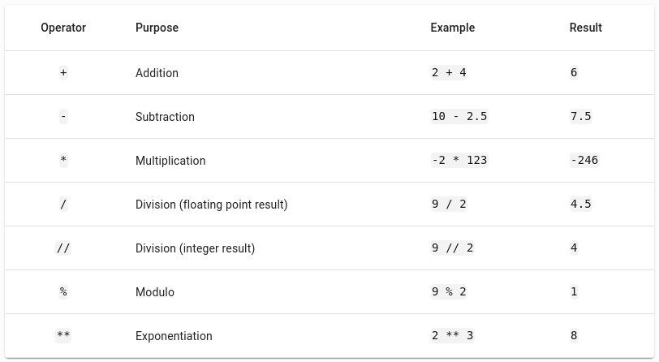
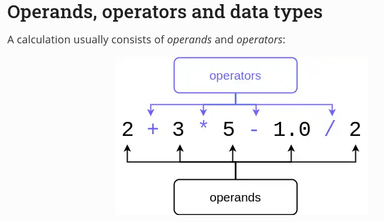
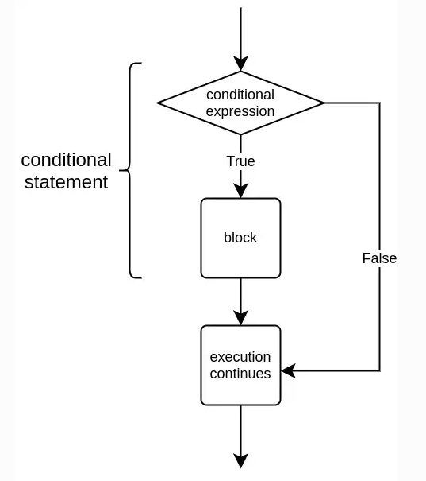
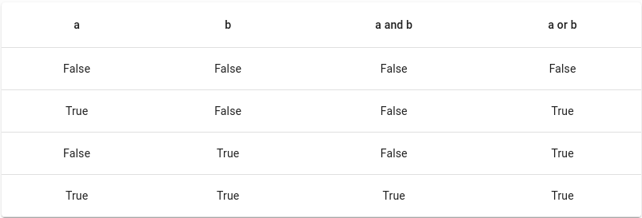
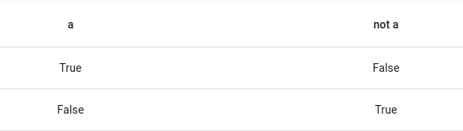
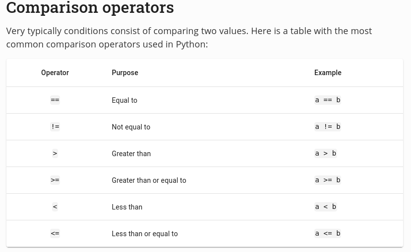
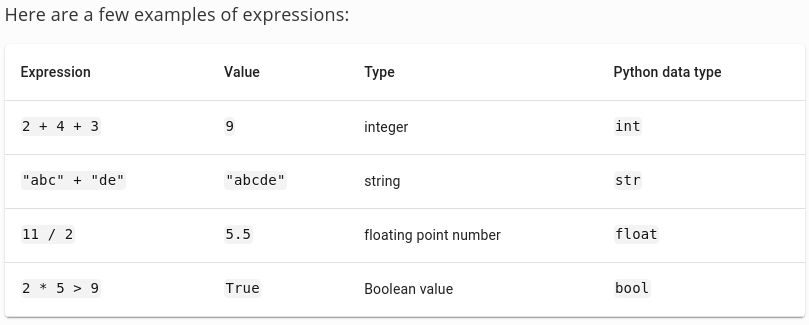
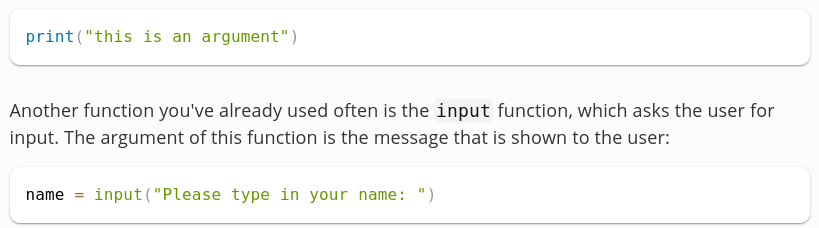
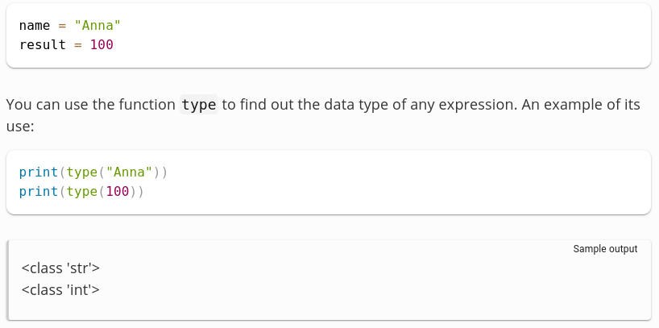
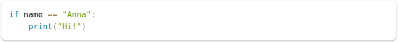

# Python

## PART 1

### print()

### Comments

### input()

### Conncatenation

### Variables

### Tipo de escribir nombre de variables

Choosing a good name for a variable
It is often useful to name variables according to what they are used for. For example, if the variable contains a word, the name word is a better choice than, say, a.

There is no set limit to the length of a variable name in Python, but there are some other limitations. A variable name should begin with a letter, and it can only contain letters, numbers and underscores _.

Lowercase and uppercase letters are different characters. The variables name, Name and NAME are all different variables. While this rule has a few exceptions, we will ignore those for now.

It is a common programming practice in Python to use only lowercase characters in variable names. If the variable name consists of multiple words, use an underscore between the words. While this rule also has a few exceptions, we will ignore those for now.

### Integer

### Combining values when printing

### Printing with f-strings

F-strings and Python versions
If you are using an older version of Python, f-strings may not work. They were introduced in Python version 3.6. Later on during the course you will install Python on your own computer. Unfortunately, the more modern versions of Python are not always available for older operating systems. If that is the case with your computer, when there are exercises requiring the use of f-strings, you can always try them out in the in-browser exercise templates in these early parts of this course.

print with end='' => one line

### Arithmetic

###  Numbers and Input

### Conditional statements

#### `elif` statement

#### Logical operators

#### Combining and chaining condicions

#### Nested conditionals

### Comparisson Operators

### Boolean values and Boolean expressions

### Libraries

#### math

* sqrt

#### difflib

* get_close_matches

#### numpy

#### pandas

#### seaborn

#### pygame

#### string

#### random

#### datetime

#### fractions

#### random

* randint

* choice

## PART 2

### Statement

A statement is a part of the program which executes something. It often, but not always, refers to a single command.

### Block

A block is a group of consecutive statements that are at the same level in the structure of the program. For example, the block of a conditional statement contains those statements which are executed only if the condition is true.

### Expression

An expression is a bit of code that results in a determined data type. When the program is executed, the expression is evaluated so that it has a value that can then be used in the program.

### Function
A function executes some functionality. Functions can also take one or more arguments, which are data that can be fed to and processed by the function. Arguments are sometimes also referred to as parameters. There is a technical distinction between an argument and a parameter, but the words are often used interchangeably. For now it should suffice to remember that both terms refer to the idea of some data passed to the function.

A function is executed when it is called. That is, when the function (and its arguments, if any) is mentioned in the code. The following statement calls the print function with the argument "this is an argument":

In this case the function also returns a value. After the function has been executed, the section of code where it was called is replaced by the value it returns; it is another expression that has now been evaluated. The function input returns a string value containing whatever the user typed in at the prompt. The value a function returns is often stored in a variable so that it can be used in the program later on.

### Data type

Data type refers to the characteristics of any value present in the program. In the following bit of code the data type of the variable name is string or str, and the data type of the variable result is integer or int:

### Syntax
Similarly to natural languages, the syntax of a programming language determines how the code of a program should be written. Each programming language has its own specific syntax.

The syntax of Python specifies, among other things, that the first line of an if statement should end in a colon character, and the block of the statement should be indented:

### Simple Loops

#### Concatenating strings with the + operator

### In the example above also the helper methods were called via the self parameter name when they were used in the constructor. It is possible to also include static method definitions in class definitions. These are methods which can be called without ever creating an instance of the class. We will return to this subject in the next part.
